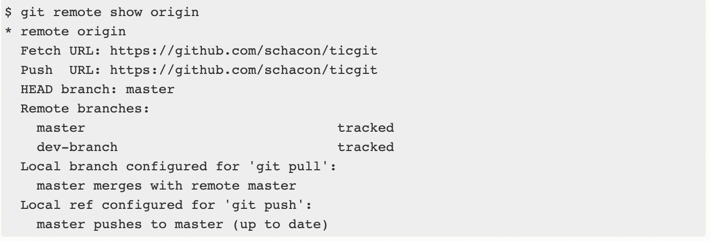
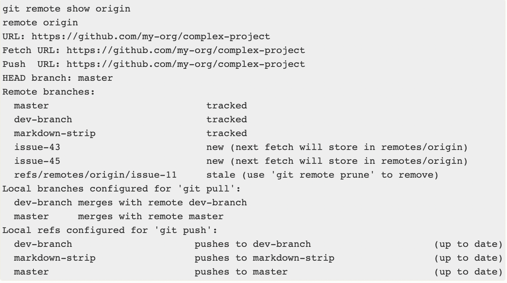

# Инструкция по работе с Git

## Начало работы с репозиторием 
>git init

Команда которая создает локальный репозиторий 

Если вы до этого не вводили имя/почту, то нужно их добавить: 
> git config --global usre.name имя

> git config --global usre.email почта

## Добавление изменений 
Для того чтобы начать отслеживать файл:

file_name:
> git add file_name 

И чтобы зафиксировать все файлы, которые мы отслеживаем:
> git commit -m "some massege"

## Отслеживание состояния репозитория
> git status

Показывает состояние репозитория, то есть файлы которые были добавлены в репозиторий или изменены. И так же показывает файлы готовые к комиту

> git log 

Показывает историю комитов

> git log --graph 

Показывает историю и визуализирует ветки

> git diff

Показывает разницу между текущим состоянием файла и тем, что отслеживается

## Информация про команды 
--help
> git init --help

## Переход между комитами
Можно перейти к прошлому комиту командой:
> git checkout commit_code

commit_code можно посмотреть с помощью команды:
> git log

Для перехода достаточно ввести первые 4 символа номера комита

Образец: git checkout c723 

## Команда для сравнения различий в двух деревьях
>git difftool

данная команда просто запускает внешнюю утилиту для показа различий в двух деревьях, на случай если вы хотите использовать что-либо отличное от встроенного просмоторщика git diff 

## Ветки в Git
Чтобы посмотреть все ветки, нужно ввести:
> git branch

Чтобы создать новую ветку с именем branch_name:
> git branch branch_name

Переход к ветке branch_name:
> git checkout branch_name

## Удаление веток: 
Для удаления ветки branch_name, нужно ввести: 

> git branch - d branch_name
она удалится если нет никаких ошибок 

Если хотит удалить несмотря на ошибки:
> git branch - D branch_name

## Слияние веток и решение конфликтов

Чтобы слить ветку branche_name в текущую, нужно: 
> git merge branch_name

В случае возникновения конфликта при merge, нужно выбрать какой из вариантов нам нужен (или оставить оба) и по необходимости модифицировать их

## Справка 
Для того чтобы вызвать спарвку по какой-то команде, нужно дописать к ней тег --help
> git add --help

> git commit --help

> git branch --help

> git checkout --help

# Работа с удаленным репозиторием 

Для того, чтобы просмотреть список настроенных удалённых репозиториев, вы можете запустить команду 
> git remote. 

Она выведет названия доступных удалённых репозиториев. 

Если вы клонировали репозиторий, то увидите как минимум origin — имя по умолчанию, которое Git даёт серверу, с которого производилось клонирование:

Вы можете также указать ключ -v, чтобы просмотреть адреса для чтения и записи, привязанные к репозиторию:

> git remote -v

## Добавление удалённых репозиториев

В предыдущих разделах мы уже упоминали и приводили примеры добавления удалённых репозиториев, сейчас рассмотрим эту операцию подробнее. Для того, чтобы добавить удалённый репозиторий и присвоить ему имя (shortname), просто выполните команду 

> git remote add shortname url

> git remote
  origin
  git remote add pb https://github.com/paulboone/ticgit
  git remote -v
  origin	https://github.com/schacon/ticgit (fetch)
  origin	https://github.com/schacon/ticgit (push)
  pb	https://github.com/paulboone/ticgit (fetch)
  pb	https://github.com/paulboone/ticgit (push)

Теперь вместо указания полного пути вы можете использовать pb. Например, если вы хотите получить изменения, которые есть у Пола, но нету у вас, вы можете выполнить команду 
> git fetch pb:

> git fetch pb
  remote: Counting objects: 43, done.
  remote: Compressing objects: 100% (36/36), done.
  remote: Total 43 (delta 10), reused 31 (delta 5)
  Unpacking objects: 100% (43/43), done.
  From https://github.com/paulboone/ticgit
 * [new branch]      master     -> pb/master
 * [new branch]      ticgit     -> pb/ticgit

 Ветка master из репозитория Пола сейчас доступна вам под именем pb/master. Вы можете слить её с одной из ваших веток или переключить на неё локальную ветку, чтобы просмотреть содержимое ветки Пола. Более подробно работа с ветками рассмотрена в главе Ветвление в Git (https://git-scm.com/book/ru/v2/%D0%92%D0%B5%D1%82%D0%B2%D0%BB%D0%B5%D0%BD%D0%B8%D0%B5-%D0%B2-Git-%D0%9E-%D0%B2%D0%B5%D1%82%D0%B2%D0%BB%D0%B5%D0%BD%D0%B8%D0%B8-%D0%B2-%D0%B4%D0%B2%D1%83%D1%85-%D1%81%D0%BB%D0%BE%D0%B2%D0%B0%D1%85#ch03-git-branching)

## Получение изменений из удалённого репозитория — Fetch и Pull

Как вы только что узнали, для получения данных из удалённых проектов, следует выполнить:

> git fetch [remote-name]

Данная команда связывается с указанным удалённым проектом и забирает все те данные проекта, которых у вас ещё нет. После того как вы выполнили команду, у вас должны появиться ссылки на все ветки из этого удалённого проекта, которые вы можете просмотреть или слить в любой момент.

Когда вы клонируете репозиторий, команда clone автоматически добавляет этот удалённый репозиторий под именем «origin». Таким образом, git fetch origin извлекает все наработки, отправленные на этот сервер после того, как вы его клонировали (или получили изменения с помощью fetch). Важно отметить, что команда git fetch забирает данные в ваш локальный репозиторий, но не сливает их с какими-либо вашими наработками и не модифицирует то, над чем вы работаете в данный момент. Вам необходимо вручную слить эти данные с вашими, когда вы будете готовы.

Если ветка настроена на отслеживание удалённой ветки (см. следующий раздел и главу Ветвление в Git чтобы получить больше информации (https://git-scm.com/book/ru/v2/%D0%92%D0%B5%D1%82%D0%B2%D0%BB%D0%B5%D0%BD%D0%B8%D0%B5-%D0%B2-Git-%D0%9E-%D0%B2%D0%B5%D1%82%D0%B2%D0%BB%D0%B5%D0%BD%D0%B8%D0%B8-%D0%B2-%D0%B4%D0%B2%D1%83%D1%85-%D1%81%D0%BB%D0%BE%D0%B2%D0%B0%D1%85#ch03-git-branching)
), то вы можете использовать команду git pull чтобы автоматически получить изменения из удалённой ветки и слить их со своей текущей. Этот способ может для вас оказаться более простым или более удобным. К тому же, по умолчанию команда git clone автоматически настраивает вашу локальную ветку master на отслеживание удалённой ветки master на сервере, с которого вы клонировали репозиторий. Название веток может быть другим и зависит от ветки по умолчанию на сервере. Выполнение git pull, как правило, извлекает (fetch) данные с сервера, с которого вы изначально клонировали, и автоматически пытается слить (merge) их с кодом, над которым вы в данный момент работаете.

* Примечание 

Начиная с версии 2.27, команда git pull выдаёт предупреждение, если настройка pull.rebase не установлена. Git будет выводить это предупреждение каждый раз пока настройка не будет установлена.

Если хотите использовать поведение Git по умолчанию (простое смещение вперёд если возможно — иначе создание коммита слияния): git config --global pull.rebase "false"

Если хотите использовать перебазирование при получении изменений: git config --global pull.rebase "true"

## Отправка изменений в удаленный репозиторий (Push)

Когда вы хотите поделиться своими наработками, вам необходимо отправить их в удалённый репозиторий. Команда для этого действия простая: 
> git push remote-name branch-name. 

Чтобы отправить вашу ветку master на сервер origin (повторимся, что клонирование обычно настраивает оба этих имени автоматически), вы можете выполнить следующую команду для отправки ваших коммитов:

> git push origin master

Эта команда срабатывает только в случае, если вы клонировали с сервера, на котором у вас есть права на запись, и если никто другой с тех пор не выполнял команду push. Если вы и кто-то ещё одновременно клонируете, затем он выполняет команду push, а после него выполнить команду push попытаетесь вы, то ваш push точно будет отклонён. Вам придётся сначала получить изменения и объединить их с вашими и только после этого вам будет позволено выполнить push. Обратитесь к главе Ветвление в Git для более подробного описания (https://git-scm.com/book/ru/v2/%D0%92%D0%B5%D1%82%D0%B2%D0%BB%D0%B5%D0%BD%D0%B8%D0%B5-%D0%B2-Git-%D0%9E-%D0%B2%D0%B5%D1%82%D0%B2%D0%BB%D0%B5%D0%BD%D0%B8%D0%B8-%D0%B2-%D0%B4%D0%B2%D1%83%D1%85-%D1%81%D0%BB%D0%BE%D0%B2%D0%B0%D1%85#ch03-git-branching), как отправлять изменения на удалённый сервер.

## Просмотр удаленного репозитория

Если хотите получить побольше информации об одном из удалённых репозиториев, вы можете использовать команду:

> git remote show remote 

Выполнив эту команду с некоторым именем, например, origin, вы получите следующий результат:

Она выдаёт URL удалённого репозитория, а также информацию об отслеживаемых ветках. Эта команда любезно сообщает вам, что если вы, находясь на ветке master, выполните git pull, ветка master с удалённого сервера будет автоматически влита в вашу сразу после получения всех необходимых данных. Она также выдаёт список всех полученных ею ссылок.

Это был пример для простой ситуации и вы наверняка встречались с чем-то подобным. Однако, если вы используете Git более интенсивно, вы можете увидеть гораздо большее количество информации от команды:

> git remote show

Данная команда показывает какая именно локальная ветка будет отправлена на удалённый сервер по умолчанию при выполнении git push. Она также показывает, каких веток с удалённого сервера у вас ещё нет, какие ветки всё ещё есть у вас, но уже удалены на сервере, и для нескольких веток показано, какие удалённые ветки будут в них влиты при выполнении git pull.

## Удаление и переименование удалённых репозиториев

Для переименования удалённого репозитория можно выполнить 

>git remote rename

 Например, если вы хотите переименовать pb в paul, вы можете это сделать при помощи git remote rename.

Стоит упомянуть, что это также изменит имена удалённых веток в вашем репозитории. То, к чему вы обращались как pb/master, теперь стало paul/master.

Если по какой-то причине вы хотите удалить удаленный репозиторий — вы сменили сервер или больше не используете определённое зеркало, или кто-то перестал вносить изменения — вы можете использовать 

>git remote rm

При удалении ссылки на удалённый репозиторий все отслеживаемые ветки и настройки, связанные с этим репозиторием, так же будут удалены.

# Удачи!